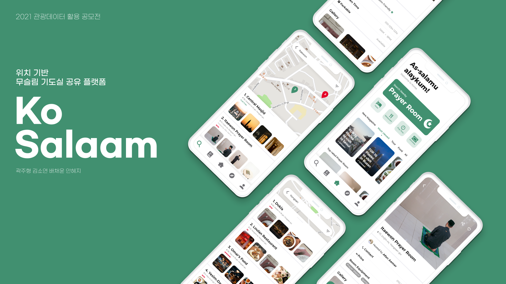
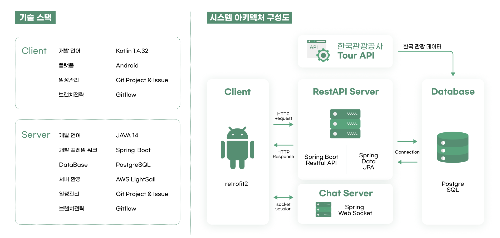
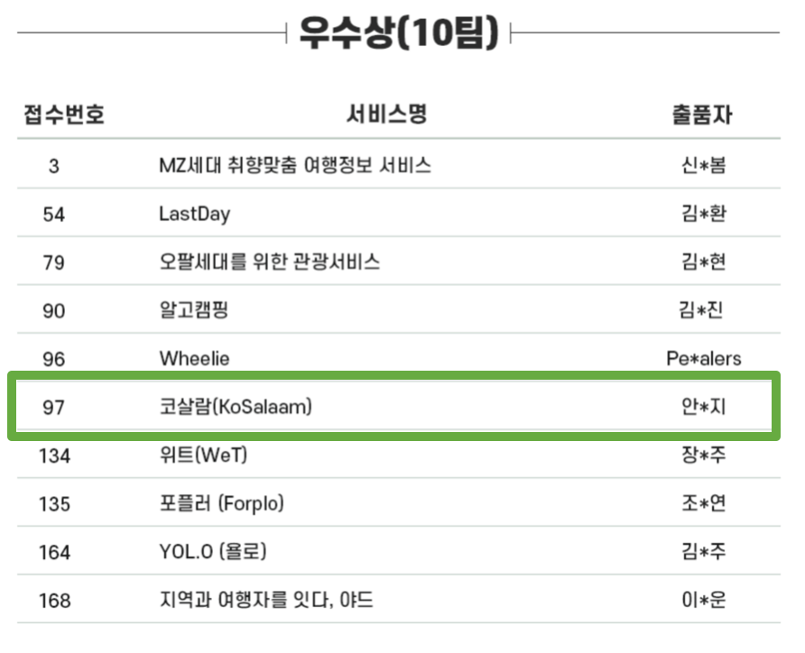

# ko-salaam-api
코살람 백엔드 API 서버 레포지터리

# 🧕 소개

---

**위치 기반 무슬림 기도실 공유 플랫폼**

현재 위치 기반으로 주변 기도실(공공/개인) 정보를 알려줌으로써
무슬림이 한국 관광 중에도 종교적 의무를 다할 수 있도록 기도실 대여 서비스를 제공하는 모바일 앱

카카오, 한국관광공사에서 주관한  2021 관광데이터 활용 공모전 출품작

### 📌 주요 기능

- 기도실 공유 기능: 국내 거주 무슬림이 운영하는 개인 기도실을 대여할 수 있다. 채팅, 결제 기능을 제공한다.
- 관광 정보 제공: 현재 위치 기반 주변 무슬림 친화 식당 / 숙소 / 기도실 정보 제공
- 마이 페이지 기능: 본인 인증, 좋아요/리뷰 등록한 관광지 모음 제공

# 🚣‍♀️ 맡은 포지션

---

- 기획 / 프로젝트 매니징
- 데이터 수집 /  데이터 갱신을 위한 배치 프로그램 개발
- 백엔드 서버 설계 및 개발

# 💻 구현

---

## 💡 프로젝트 구조

### 개발 도구

- Java11, SpringBoot(API 서버)
- Spring Data JPA(ORM)
- Spring Web Socket(채팅)
- PostgreSQL

### DevOps

- Docker와 Github Action을 이용한 CI/CD 환경 구축
- AWS Light Sail, CentOS(API 서버), PostgresSQL(DB 서버)

# 🌟 결과

---

다양한 공공데이터를 활용하여 창의적이고 실효성 있는 서비스를 개발한 성과를 인정받아
2021 관광데이터 활용 공모전에서 **우수상**을 수여 받았다.

# 📎 Link

---
- [DEV API 서버](http://52.79.248.96:8080/swagger-ui/index.html)
- [관광데이터 활용 공모전](https://www.2021tourapi.com/)
- [Figma](https://www.figma.com/file/YqOVzZFs9xrGhPTitAW9Mz/KoSalaam%2F%EC%BD%94%EC%82%B4%EB%9E%8C?node-id=61%3A1)